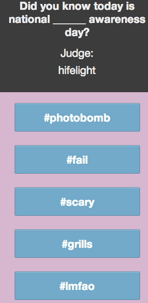

Hashtags
========

Hashtags is a game like Apples to Apples and Cards Against Humanity.  It is designed for phones so it may look a little weird on a full screen browser window.
 

How to play:
<ol>
<li>Create a game and invite friends.</li>
<li>Players and Judge get a prompt.</li>
<li>Players choose from their hand of hashtags and pull images/video from Instagram corresponding to that hashtag.</li>
<li>Players anonymously submit to the judge an image/video to answer the prompt.</li>
<li>When all submissions are in, the judge selects the best answer and the player that submitted it gets a point.</li>
<li>Judge switches and the next round commences.</li>
</ol>
 

Technologies:
<ul>
  <li>Node.js with Express.js</li>
  <li>Socket.io</li>
  <li>Passport-Instagram (oAuth)</li>
  <li>Instagram API</li>
  <li>MongoDB with Mongoose</li>
  <li>Backbone.js</li>
</ul>
</n>
 

[]

  If you have feedback or want to submit prompt ideas, mosey on down to http://hashtagsfeedback.meteor.com